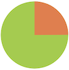

# A simple dynamic pie chart

This component implements a simple, two-color pie chart. The relative
size of the two pie slices can be adjusted dynamically, allowing the
chart to implement a visual clock: for instance, how much time 
remains before some deadline.

The pie chart can be given the following input parameters:
* _size_: size of the chart in screen pixels; defaults to 100
* _progress_: a percentage between 0 and 100, indicates the size of 
  the 'progress' slice; defaults to 25
* _progressColor_: color of the 'progress' slice; defaults
  to a shade of orange
* _backgroundColor_: color of the other' slice; defaults
  to a shade of green
  
Leaving all values to their defaults will generate the following
pie chart:



Invoked as follows:
```html
<dynamic-two-color-pie-chart
    size="100"
    progressColor="darkred"
    backgroundColor="yellowgreen"
    progress="60">
</dynamic-two-color-pie-chart>
```
the component will produce


A clock effect can be obtained by changing the value of _progress_ dynamically:
```html
<dynamic-two-color-pie-chart progress="{{ completionPercent }}">
</dynamic-two-color-pie-chart>
```
More dramatic effects can be obtained by changing the 
progress and background colors based on the actual progress.

## Credits

This implementation is based on an 
[article on smashingmagazine.com](https://www.smashingmagazine.com/2015/07/designing-simple-pie-charts-with-css/).
